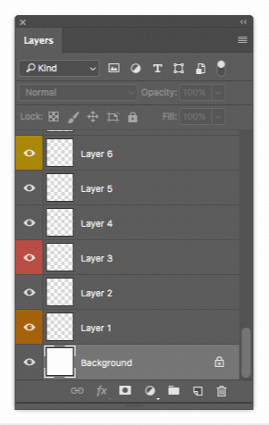
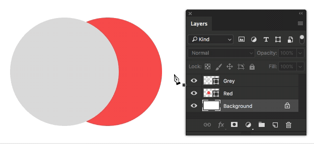

- [Usage](#Usage)
- [Align to selection after move](#Align-to-selection-after-move)
- [Selecting layers in the document instead of the layers panel...](#Selecting-layers-in-the-document-instead-of-the-layers-panel)
  - [Selecting with move tool:](#Selecting-with-move-tool)
  - [Selecting layers without the move tool:](#Selecting-layers-without-the-move-tool)
- [Known issues](#Known-issues)
- [More Info](#More-Info)

# Photoshop Move Layers Script (Move Layers.jsx) <!-- omit in toc -->

Alternative to moving layers by dragging in the `Layers panel`. Really handy if target position is outside of the viewport of the layers panel and you need to scroll to it.

> The gif is slightly outdated. Layers are no longer grouped since version 1.2.

## Usage

1. Select your input layer(s) → _Run the script for the first time
2. Select your destination layer → _Run the script for the second time

> Warning: Don't do anything, except select the target layer between step 1 and 2.

## Align to selection after move

If you make a selection with the marquee tool before step 1, the layers are centered to that selection after the move. There shouldn't be a need to turn this behavior off in normal use, but do that by setting a variable called `useAlignToSelection` to `false`. 

## Selecting layers in the document instead of the layers panel...

In addition to selecting layers in the layer panel, you can also select layers by directly clicking them in the document. Selecting layers in the document has some advantages, especially if your layer structure is a mess.

### Selecting with move tool:

1. Select `Move tool`
2. `Cmd + Click` a layer in the document to select it.
    - Holding down `Cmd` temporarily toggles the Auto select when using the `Move tool`. At least I would recommend having auto select unchecked and toggle it on with `Cmd`.

This method goes through locked layers.

_You can also add the modifier key `Shift` and select more layers._

### Selecting layers without the move tool:

I tend to use this method most of the time.

1. `Cmd + Alt + Right click` a layer in the document with almost any tool active.

This method selects locked layers just like any other layer.

_You can also add the modifier key `Shift` and select more layers. Click a layer again while still holding `Shift` and it's unselected_

> Note that in Windows you should think of every `Cmd` I mentioned here as `Ctrl`. In Mac `Cmd` is used for most shortcuts that use `Ctrl` in Windows.

## Known issues
- ~~The scroll position may shift around a bit at times. I would say it's negligible....~~ Fixed in v.1.2.
- In v.1.2.-1.3. "Align to selection" will silently fail if it's unable to create a group in the target scope. This will happen if the scope has maximum allowed nested groups (10) already.

## More Info

- This was written for Photoshop CC so I can’t guarantee it’ll work on anything older.
- You’ll definitely want to assign this script a shortcut (or some other third party method). Otherwise it's not very useful.
    - I personally have a button set to trigger this script in my [Elgato Stream Deck](https://www.elgato.com/en/gaming/stream-deck).
